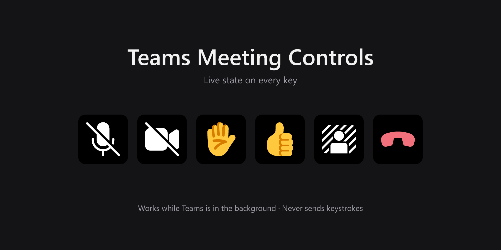
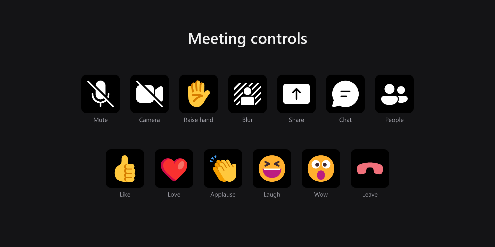
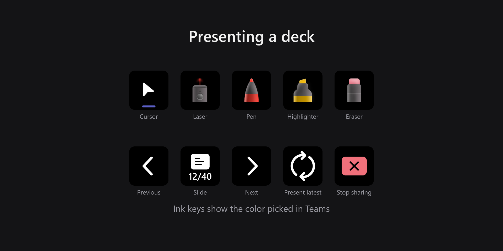
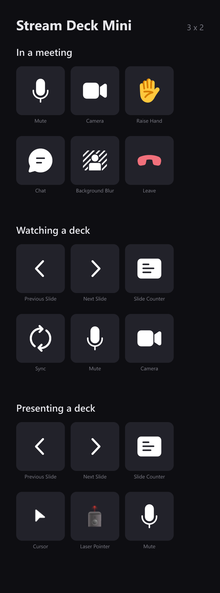
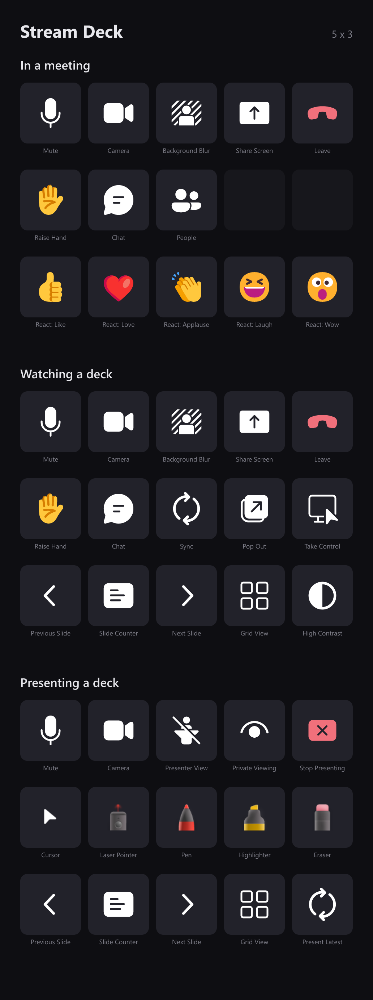
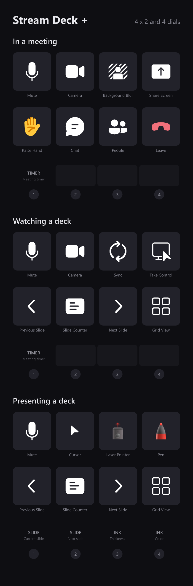
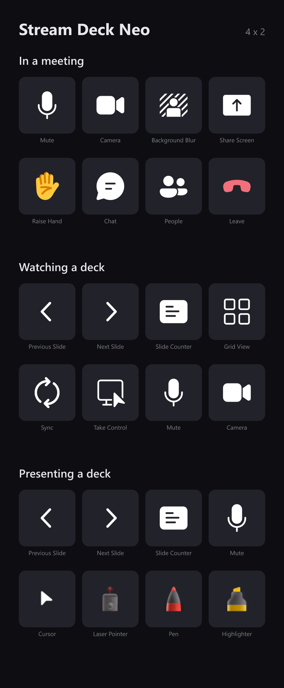
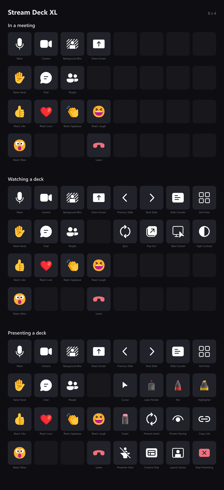
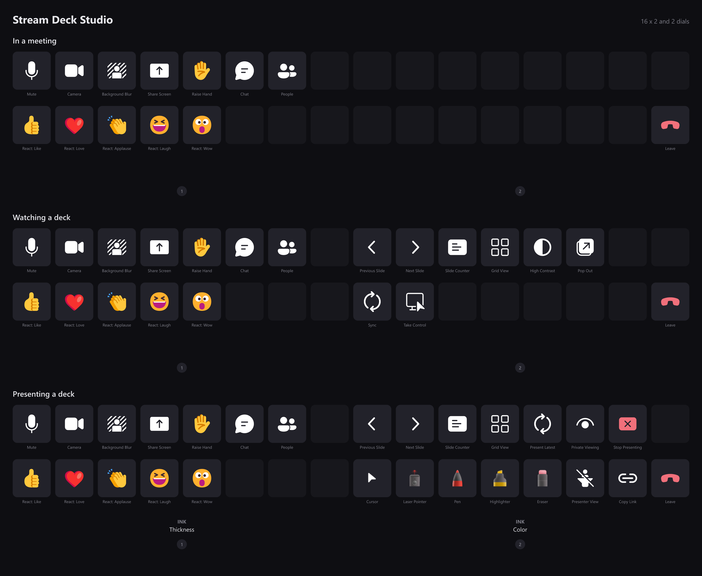
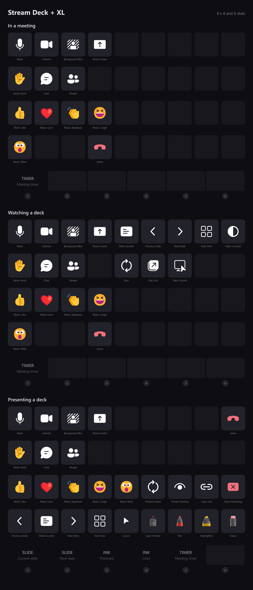

<div align="center">



# Teams Meeting Controls for Stream Deck

**Mute, camera, reactions, screen share and the whole of PowerPoint Live —
from your Stream Deck, with the real state on every key.**

[](https://github.com/danswett/streamdeck-teams-control/actions/workflows/build.yml)
[](https://github.com/danswett/streamdeck-teams-control/releases)
[](LICENSE)


[Install](#install) · [What you can control](#what-you-can-control) ·
[Dials](#dials-and-the-touch-strip) · [Your deck](#every-deck-and-what-it-gets) ·
[Privacy](#privacy) · [How it works](#how-it-works)

</div>

---

## The short version

Your Stream Deck shows whether you are **actually** muted, not whether you last
pressed something.

- **Live state on every key.** The mute key knows it is muted because it asked
  Teams, so it stays right when you mute from the Teams window, a headset
  button, or anywhere else.
- **Teams never needs focus.** Keep typing in your editor. Teams is never pulled
  to the front and the cursor never moves.
- **No keystrokes are sent.** Nothing is typed into whatever you happen to have
  open, so there is no window for a shortcut to land in the wrong place.
- **Everything dims when it should.** Not in a meeting? The keys go gray. No deck
  being presented? The PowerPoint Live keys go with them.
- **Optional profile switching.** The deck can follow the meeting — one layout
  for a meeting, another when a deck goes up, back again when it ends.
- **Every Stream Deck is covered.** Mini, Stream Deck, +, Neo, XL, Studio and
  + XL each get layouts built for their own grid, and the decks with dials get
  those too. [See what yours gets.](#every-deck-and-what-it-gets)

> **Windows only.** See [Why not macOS?](#why-not-macos)

---

## Why it exists

Microsoft retired the local Teams third-party API (`ws://localhost:8124`) on
**30 June 2026**, under message center notice **MC1266901**. That API powered
Microsoft's own Teams Stream Deck plugin, MuteMe, Dell's collaboration keyboards
and most other hardware Teams integrations.

No replacement shipped. The retirement notice says only that "published
Microsoft Graph APIs" are unaffected — but Graph cannot mute your local Teams
client. The guidance vendors landed on was *use keyboard shortcuts*, which needs
the Teams window focused and reports no state at all.

This plugin takes a different route: it drives Teams through **UI Automation**,
the same accessibility layer screen readers use.

| | Old local API | Keyboard shortcuts | This plugin |
|---|---|---|---|
| Works after June 2026 | ❌ | ✅ | ✅ |
| Works when Teams is unfocused | ✅ | ❌ | ✅ |
| Sends synthetic keystrokes | ❌ | ✅ | ❌ |
| Shows live mute / camera state | ✅ | ❌ | ✅ |
| Officially supported contract | was | ✅ | ❌ — see [Stability](#stability) |

---

## What you can control

### In any meeting



| Action | Shows | Notes |
|---|---|---|
| **Mute** | ✅ muted / unmuted | Slashed glyph when muted |
| **Camera** | ✅ on / off | Slashed glyph when off |
| **Raise Hand** | availability only | Lifts on press |
| **React** — Like, Love, Applause, Laugh, Wow | availability only | Five actions, each animates on press |
| **Background Blur** | availability only | |
| **Share Screen** | ✅ sharing / not | Opens the share tray |
| **Chat** | availability only | Toggles the meeting chat pane |
| **People** | availability only | Toggles the participant roster |
| **Leave** | availability only | Press opens Teams' confirmation; hold to answer it |

### Presenting a deck



A second set of keys appears when a deck is shared through **PowerPoint Live**.
Teams gives you a different toolbar depending on whether you are watching or
driving, and the keys follow: each one declares the role it needs and dims in
the other.

**Either role**

| Action | Shows | Notes |
|---|---|---|
| **PPT Live: Slide Counter** | ✅ `3/19` | Not pressable. Can also show the slide itself — see [Slide thumbnails](#slide-thumbnails) |
| **PPT Live: Previous / Next Slide** | availability only | Dims at the ends of the deck |
| **PPT Live: Grid View** | ✅ open / closed | All slides as thumbnails |
| **PPT Live: High Contrast** | availability only | Your screen only |
| **PPT Live: Pop Out** | availability only | Moves the shared content to its own window |

**Watching**

| Action | Shows | Notes |
|---|---|---|
| **PPT Attendee: Sync** | ✅ lights when out of sync | Teams only offers this once you have browsed away, so a lit key *is* the "you are viewing privately" signal |
| **PPT Attendee: Take Control** | availability only | ⚠️ Makes you the presenter |

**Driving**

| Action | Shows | Notes |
|---|---|---|
| **PPT Presenter: Laser / Pen / Highlighter / Eraser / Cursor** | ✅ active tool, in its ink color | Tracks a tool picked in Teams too |
| **PPT Presenter: Private Viewing** | ✅ on / off | Lets attendees browse on their own, or stops them |
| **PPT Presenter: Presenter View** | ✅ showing / hidden | Your notes and thumbnails. Your screen only |
| **PPT Presenter: Present Latest** | availability only | Reloads the deck to pick up saved edits |
| **PPT Presenter: Copy Link** | availability only | Copies a link to the deck |
| **PPT Presenter: Content Only / Layout Cameo** | availability only | Cameo dims until your camera is on |
| **PPT Presenter: Stop Presenting** | availability only | Press opens Teams' confirmation; hold to answer it |

**Take control** is the one key that changes which set you get. Press it as an
attendee and Teams makes you the presenter: that key retires, *Sync* goes with
it, and the drawing tools, *Private view* and *Stop presenting* light up in
their place.

---

## Dials and the touch strip

Two decks have dials: the **Stream Deck +** with four and the **Stream Deck + XL**
with six. They get the parts of a presentation that a key cannot show.


| dial | shows | turn | press |
|---|---|---|---|
| **Current slide** | the live slide, bordered red | moves through the deck | grid view |
| **Next slide** | the slide after it | — | — |
| **Ink thickness** | 1 to 6, Teams' own range | sets it | — |
| **Ink color** | the tool's palette | sets it | — |
| **Meeting timer** | time left, and a bar that drains | — | start / pause, hold to reset |

Every strip gives a dial the same canvas, so a + shows exactly what a + XL does
— it just has four slots to the + XL's six. The five dials above are one more
than a + can hold while presenting, so on that deck the timer keeps its dial on
the meeting and attendee layouts instead.

The **Stream Deck Studio** has two dials and no screen behind them. It gets ink
thickness and color, which you read the result of in Teams rather than on the
deck; a slide thumbnail would have had nowhere to appear.

The ink dials act on whichever drawing tool is selected rather than owning one,
so picking the pen points both at the pen. They go quiet for tools with nothing
to set: the laser has a color but no thickness, and the cursor and eraser have
neither.

### Slide thumbnails

The current-slide and next-slide dials show the deck itself, and the slide
counter key can show the current slide above its count.

**These are off until you turn them on**, in each action's settings. Everything
else in this plugin reads which controls exist and what state they are in; these
read what is *on* a slide. The picture is copied from the Teams window to the
deck on your desk — nothing is uploaded, saved to disk, or written to any log.

Two details worth knowing:

- **The current slide is the live one.** It comes from the slide surface rather
  than a thumbnail, so a build that has not fired yet is missing here too, and
  ink appears as you draw it.
- **The next slide needs presenter view open**, because its filmstrip is where
  that picture comes from. Without it, the dial shows the slide's name instead.

---

## Profiles that follow the meeting

The plugin ships three layouts per supported deck and can move between them as a
meeting goes:

| when | layout |
|---|---|
| You join a meeting | **Teams Meeting** — mute, camera, reactions, chat, leave |
| A deck starts, and you are watching | **PowerPoint Live (Attendee)** |
| A deck starts, and you are presenting | **PowerPoint Live (Presenter)** |
| The deck stops | back to **Teams Meeting** |
| You leave | back to whichever profile you were on before |

Each PowerPoint Live layout keeps mute within reach on every deck, so being
moved onto a presentation layout never costs you the meeting basics.

**It is off by default.** Turn it on in any PowerPoint Live key's settings; the
setting is shared by all of them.

### Every deck, and what it gets

| deck | grid | dials |
|---|---|---|
| Stream Deck Mini | 3 × 2 | — |
| Stream Deck | 5 × 3 | — |
| Stream Deck + | 4 × 2 | 4, with a touch strip |
| Stream Deck Neo | 4 × 2 | — |
| Stream Deck XL | 8 × 4 | — |
| Stream Deck Studio | 16 × 2 | 2, no screen |
| Stream Deck + XL | 9 × 4 | 6, with a touch strip |

Open any deck below to see all three of its layouts, key by key.

<details>
<summary><b>Stream Deck Mini</b> — 3 × 2</summary>



</details>

<details>
<summary><b>Stream Deck</b> — 5 × 3</summary>



</details>

<details>
<summary><b>Stream Deck +</b> — 4 × 2 and four dials</summary>



</details>

<details>
<summary><b>Stream Deck Neo</b> — 4 × 2</summary>



</details>

<details>
<summary><b>Stream Deck XL</b> — 8 × 4</summary>



</details>

<details>
<summary><b>Stream Deck Studio</b> — 16 × 2 and two dials</summary>



</details>

<details>
<summary><b>Stream Deck + XL</b> — 9 × 4 and six dials</summary>



</details>

Those pictures are generated from the profiles that actually ship, by
`npm run profiles`, so they cannot drift from what installs. The keys are drawn
exactly as the deck draws them — the captions underneath are for the page, not
something that appears on the hardware.

A deck only gets a layout when its grid is fixed and published. That leaves out
the Pedal, which publishes no key layout, and Stream Deck Mobile and the Virtual
deck, which are whatever size you make them. Those are left alone entirely
rather than handed a layout built for a grid they do not have.

<details>
<summary>What changes between decks</summary>

**Sixteen keys or more** — Stream Deck XL, Studio and + XL hold the meeting
still underneath the presentation: the same meeting keys are in the same places
in all three layouts, so a profile switch never moves mute out from under the
finger already reaching for it. Only the presentation half changes.

**Eight keys or fewer** — the Mini, Stream Deck, + and Neo do not have the room
for that, so each layout uses every key for whatever is happening now. Mute is
in all of them.

**Dials** follow the same rule as keys: what fits, fits. A + has four and the
presenter layout uses all of them, so the meeting timer keeps its dial on that
deck's other two layouts instead. The Studio has two dials and no screen behind
them, so it gets the two controls you read the result of in Teams — ink
thickness and color — rather than a slide thumbnail with nowhere to appear.

</details>

---

## Install

### From a release

Download the `.streamDeckPlugin` file from
[Releases](https://github.com/danswett/streamdeck-teams-control/releases) and
double-click it.

Stream Deck will ask whether to install the bundled profiles. Accept if you want
[automatic profile switching](#profiles-that-follow-the-meeting); decline and
everything else still works.

### From source

Requires **Node 24+**, **.NET 10 SDK** and **Stream Deck 7.1+**.

```bash
git clone https://github.com/danswett/streamdeck-teams-control.git
cd streamdeck-teams-control
npm install
npm run build
npx streamdeck link com.bad-duck.teamscontrol.sdPlugin
```

Then **restart the Stream Deck app** — it only discovers newly added plugins at
start-up.

Linking copies files into place and skips Stream Deck's installer, which has one
consequence: **bundled profiles are only registered when Stream Deck installs a
packaged plugin itself.** To exercise the profiles, open the packed
`dist/*.streamDeckPlugin` instead and accept the prompt.

---

## Privacy

The plugin talks only to the local Teams window and the local Stream Deck app.
It makes no network calls, collects no telemetry, and opens no TCP or UDP port —
the sidecar speaks to the plugin over its own stdin and stdout.

By default it reads only the **state of meeting controls**: which buttons exist,
and whether they are on, off or unavailable. No message or meeting content.

**Slide thumbnails are the exception, and are off until you switch them on.**
With one enabled, the plugin copies the slide from the Teams window and sends it
to your Stream Deck. That picture is never uploaded, never written to disk and
never logged, and each one replaces the last. Turning the setting off drops the
picture immediately, including the copy the sidecar holds for its cross-fade.
Switching a thumbnail on or off is recorded in the plugin log, so it can be
answered after the fact.

The meeting window title is read to tell a meeting window from a chat window,
but is never written to the log.

**Before attaching a `discover` dump to an issue**, read it. It lists every
interactive control in the meeting window — automation id, accessible name and
enabled state. Teams labels controls by action ("Mute", "Open chat"), so an
ordinary dump contains no names, but a pane listing people can put participant
names in a control label. That is also why the dump has no button anywhere in
the plugin: it has to be asked for deliberately.

---

# How it works

```
Stream Deck app
      │  Stream Deck WebSocket protocol
      ▼
plugin.js ── Node 24, @elgato/streamdeck v2
      │  JSON lines over stdin/stdout
      ▼
TeamsBridge.exe ── .NET 10 + FlaUI (UIA3)
      │  UI Automation / COM
      ▼
Microsoft Teams (ms-teams.exe, WebView2)
```

Five things make this reliable:

1. **Chromium builds its accessibility tree lazily.** A UIA walk of the Teams
   window returns *zero* elements until a client asks for it. The sidecar sends
   `WM_GETOBJECT`/`OBJID_CLIENT` to every Teams window first — the same signal a
   screen reader sends. Without it the tree is empty.

2. **Controls are found by `AutomationId`, not by label.** Teams exposes stable,
   locale-independent ids on the meeting toolbar (`microphone-button`,
   `video-button`, `hangup-button`, `share-button`, `reaction-menu-button`,
   `chat-button`, `roster-button`) and inside the React flyout
   (`raisehands-button`, `like-button`, `heart-button`, `applause-button`,
   `laugh-button`, `surprised-button`).

3. **Controls are pressed by posting mouse messages, not by UIA `Invoke`.**
   Invoke works, but Chromium *activates its window* when it runs, which yanks
   Teams to the front on every press. A `WM_LBUTTONDOWN`/`UP` posted to the child
   `Chrome_RenderWidgetHostHWND` goes into that window's message queue instead:
   no focus, no raised window, no cursor movement. Sampled every 10 ms, the
   foreground window never changes. UIA `Invoke` stays as the fallback where
   there are no on-screen bounds, such as a minimized window.

   It is also why flyouts are not disruptive — the popup opens *behind* whatever
   you are working in.

4. **State comes from the accessible name, which is the inverse of state.** The
   label describes the action the button performs, so `Unmute mic` means you are
   currently muted. This part is localized — see [Other languages](#other-languages).

5. **State is event-driven, not polled.** The sidecar subscribes to UI Automation
   property-change events on the controls it has resolved, so a change made in
   Teams itself reaches the keys without waiting for a tick — **315 ms on
   average, 364 ms worst**, measured with a second sidecar performing the toggle
   so the watcher could not shortcut it. The subscriptions measured at 0.00% CPU
   and +0.2 MB.

   Polling stays as a backstop — every 3 s in a meeting, 15 s otherwise — because
   UIA events are not guaranteed to be delivered.

Elements are cached and re-resolved only when they go stale, so a state read
costs a single property read per control.

### Cost

Measured in a live meeting over a 15-minute soak, 147 presses, sampled from the
OS once a second:

| | CPU (avg) | CPU (p95) | working set | private |
|---|---|---|---|---|
| sidecar, in a meeting | 0.27% | 0.77% | 33–96 MB | ~40 MB |
| sidecar, idle | 0.06% | — | ~49 MB | ~14 MB |

Working set is quoted as a range because it is one: the sidecar returns memory
to the operating system on a timer — every 60 s idle, every 5 minutes during a
meeting, since the collection competes with key presses — so it sawtooths rather
than settling on a number. Private bytes reach a steady state of about 40 MB
after roughly six minutes and stay there; handle count likewise plateaus.

Direct mode costs no more CPU than the accessibility path: the same soak run
with it enabled measured 0.27% average and 0.77% at p95, identical to the figures
above.

What a press costs, timed at the sidecar's own process boundary:

| Operation | Time |
|---|---|
| Reaction, accessibility path | ~1.4–1.9 s (flyout visible) |
| Reaction, Direct mode | ~0.3 s (nothing visible) |
| Slide thumbnail, 200×100 | 254–381 ms |
| Slide thumbnail, 1024×1024 | ~414 ms |
| Full state snapshot | 571–950 ms |
| First state after launch | 1.4–3.7 s |

Discovery is the expensive operation — a *failed* UIA search walks an entire
window subtree — so windows that turn out not to be meetings are cached as such,
and the first snapshot after launch is the slowest one the sidecar ever does.

### Direct mode (optional, off by default)

One cost is visible: a control that lives inside a flyout needs that flyout
**open on screen**, because Chromium only builds menu items into the
accessibility tree once the popup is genuinely showing. Reactions, background
blur, the PowerPoint Live menus and the ink palette all work this way.

**Direct mode** drives those same controls by running JavaScript inside Teams'
own page, where the menu can be opened, used and closed while styled invisible —
nothing appears on screen, and a reaction completes in ~240 ms rather than
seconds. It also works with Teams minimized, and can jump straight to a slide
without opening grid view.

It needs a local debugging port on Teams, which is **unauthenticated**, so the
plugin never opens one: it only uses a port the user opened deliberately, and
verifies the port belongs to Teams before touching it. Anything Direct mode
cannot improve falls back to the normal path, so the worst case is the behaviour
above.

See **[docs/direct-mode.md](docs/direct-mode.md)** for the tradeoff and the
steps.

---

## Bundled profiles

Stream Deck only lets a plugin switch to profiles it ships itself, so the
layouts are generated by `tools/build-profile.ts` rather than made by hand. They
use Stream Deck's version 3.0 profile format; 2.0 installs silently and does
nothing. A deck with dials needs an `Encoder` controller in every page, even an
empty one.

Twenty-one of them ship — three states across seven decks — and
`tools/decks.ts` is the one place that says how big each deck is. A profile does
not record its own grid, so the builder and the picture generator would
otherwise each need their own copy of those numbers.

`tests/profiles.test.ts` checks the things that drift one key at a time: that
mute survives into every layout, that the shared meeting block really is
identical across the decks wide enough to hold one, that the + and the Neo have
not diverged despite having the same grid, and that no key lands outside its
deck.

Two behaviors decide how all this is shipped, and both were established by
experiment rather than from the documentation:

- **`Device.Model` in a shipped profile is ignored.** It looks like the field
  that binds a profile to a deck. A profile deliberately carrying
  `"ZZTESTMODEL"` installed onto a 15-key anyway, and Stream Deck replaced the
  value with that deck's own model and USB identity. What selects the hardware
  is the manifest's `Profiles[].DeviceType` and the device passed to
  `switchToProfile`. So a deck whose model code Elgato has not published ships
  an empty one rather than a guess.
- **A bundled profile installs on demand, not at load.** Six profiles were
  declared on a machine with both decks attached and only four were ever
  installed; the two never switched to did not exist on disk. Shipping layouts
  for decks a user does not own therefore costs them nothing.

### Shipping a changed layout

**Stream Deck installs a bundled profile once and never looks at the shipped copy
again.** Change a layout, publish the update, and existing users stay on the old
one — the switch still succeeds, so nothing is reported anywhere.

It identifies an installed profile by the plugin that installed it and the
**path** it came from, which it writes into the installed copy's
`PreconfiguredName`. A path it has not seen is the only thing it treats as new.

So a profile carries a `revision`, which `tools/build-profile.ts` appends to both
the file name and the profile's own name once it is above 1:

```ts
{
    name: "PowerPoint Live (Presenter)",
    device: PLUS_XL,
    revision: 2,          // -> profiles/PowerPoint Live (Presenter) (+ XL) r2
    ...
}
```

**A revision does not replace anything.** It ships a second profile, and the
first one stays on the deck forever, because a plugin cannot remove a profile and
Stream Deck never retires one it no longer sees in the manifest. The revision is
in the displayed name for that reason: left to itself Stream Deck files the new
arrival under the old name as "copy", "copy 1", "copy 2", and nothing on the deck
says which is current.

So bump a revision only for a layout users already have and that is worth a
permanent extra entry in their list. A layout that has never shipped can be
edited freely.

Either way the change has to be deliberate, because doing nothing also fails
silently — the update simply reaches nobody. Each profile records a `layoutHash`
covering the deck it targets and every key and dial on it, and **the build fails**
when that moves, asking which of the two situations this is:

```
1 profile(s) no longer match their recorded layout.

  PowerPoint Live (Presenter) (+ XL)
      layout no longer matches layoutHash: "211ff6d3"

      If this layout has NOT shipped yet, just record the new one:
          layoutHash: "21fe4871"

      If users already have it, they can only be moved by shipping a
      new path, which leaves their old copy behind for good:
          revision: 2, layoutHash: "21fe4871"
```

The fingerprint ignores the plugin version deliberately. Tying the path to the
version would change it on every release, handing every user a new profile and
stranding whatever they had customized on the old one.

A few operational notes:

- **A revision bump is user-visible.** Installing a profile puts a dialog in
  front of the user, and they can decline.
- **That dialog holds Stream Deck's profile lock until it is answered**, which
  may be hours. A second switch request meanwhile is refused with `Another
  operation is already in progress`. Repeat asks for the same path are therefore
  suppressed for 30 s and given up after three, while a genuine change of target
  still switches immediately.
- **Stream Deck re-reads the manifest when the app starts**, not when plugin
  files change, so a newly declared profile needs an app restart to be noticed.

`tools/check-profile.mjs` compares a generated profile against one Stream Deck
wrote itself for the same model, which catches a profile that is almost right:

```bash
node tools/build-profile.ts
node tools/check-profile.mjs "com.bad-duck.teamscontrol.sdPlugin/profiles/Teams Meeting (+ XL).streamDeckProfile"
```

---

## Dials and the touch strip

A dial is not a key with a different shape. A key press is one discrete request,
and the key path already refuses a second while one is in flight. A dial produces
a stream of ticks, and everything behind this plugin is a UI Automation walk —
one walk per tick would queue a whole spin and go on driving the deck long after
the user let go.

So turning and acting are kept apart: ticks accumulate into a local value, the
touch strip shows it immediately, and the work that makes it true is issued once
the dial goes still. A whole gesture collapses into one command.

### Ink

Ink color and thickness are UI Automation patterns rather than menu items —
thickness is a slider carrying `RangeValue` over 1..6, and every color is a
radio button carrying `SelectionItem` — so neither needs a posted click, and a
change measures around 375 ms against the ~4.5 s a flyout walk costs.
`sidecar/probe-ink-flyout.ps1` re-establishes this when Teams moves something.

Three things about that flyout:

- **The palette belongs to the tool.** The pen offers Dark yellow, Magenta and
  Dark red where the highlighter offers Pink, Faded green, Faded blue and Faded
  red. `inkColorNames` in `selectors.json` is a union of both and matches
  neither, so the open flyout is the authority.
- **Expanding a tool is not reliable once.** Teams hides the slide-show toolbar
  when the pointer is away and rebuilds it on demand, and an expand landing
  mid-rebuild does nothing. The sidecar asks twice.
- **An open flyout unmounts the whole slide-show subtree**, so a deck still being
  presented looks exactly like one that has stopped. The flyout is always closed
  again, and the close is confirmed by watching the subtree return.

### Moving through the deck

Turning the current-slide dial draws the number it is heading for over the dimmed
thumbnail and jumps once the dial settles. The jump invokes the slide's filmstrip
thumbnail directly rather than walking with Next — **Next advances the build, not
the slide**, so on an animated deck counting presses lands somewhere else.

**Turning needs presenter view open, and does nothing while the grid is up.** The
filmstrip is the only list of slides that can be aimed at without moving the
deck. The grid's tiles look equivalent and are not: selecting one navigates *and*
closes the grid, and `SetFocus` on one paints nothing, because Teams only draws a
ring for `:focus-visible`. `sidecar/probe-real-grid.ps1` checks this, scoped to
`fluent-grid-view` so it cannot match the filmstrip by mistake.

### Slide thumbnails

PowerPoint Live exposes no image of a slide anywhere in the accessibility tree —
only its name — so the picture is taken off the Teams window with
`PrintWindow(PW_RENDERFULLCONTENT)`, which draws the window on request and is
therefore occlusion-proof. `CopyFromScreen` captures whatever is on top instead.

The two slots come from different places:

- **Current slide** is the live slide surface: the 16:9 image inside
  `slideshow-app-container`, matched on shape because it carries neither name nor
  id. It needs no presenter view.
- **Next slide** comes from the presenter-view filmstrip, so it needs presenter
  view, and shows that slide fully built — a slide nobody has reached has no live
  render to read.

Teams scrolls the filmstrip so the *current* slide sits at its trailing edge,
which leaves the next slide just past the end. It is scrolled into view with
`ScrollItemPattern`, which scrolls without selecting — the distinction matters,
because these items also carry `Invoke` and `SelectionItem`, and selecting one
would drive the presentation for everyone in the meeting.
`sidecar/probe-scroll-safety.ps1` fails loudly if a scroll ever moves the
selection. When scrolling cannot help — the strip refuses, presenter view is
closed, or Teams is minimized — the slot falls back to the slide's name on a
card.

A filmstrip item reports its whole rectangle whether or not it is scrolled into
view, and UI Automation calls it offscreen only once *none* of it shows. A
half-scrolled slide is therefore offered at a rectangle running over whatever is
beside it, so items are clipped to the list they sit in and anything much short
of whole is refused rather than cropped. `SlideClipTests` pins that geometry.

#### Watching a slide that is not moving

Ink and builds change a slide without changing anything Teams reports, and the
sidecar emits state only on change — one message in fifteen seconds while sitting
on a slide. So the live slot keeps its own clock. A capture costs about 80 ms:

| when | re-read every |
|---|---|
| a pen, highlighter or eraser is selected | 250 ms |
| something changed in the last 12 s | 700 ms |
| otherwise | 3 s |

None of it runs unless a thumbnail is switched on. The laser is excluded: it
moves constantly and leaves nothing behind. An unchanged slide encodes
byte-identical, so idling costs no traffic to the deck.

Slide changes cross-fade over six JPEG frames of about 6 KiB, blended in the
sidecar where the bitmaps already are. Polled re-reads land immediately instead,
so ink appears under the presenter's hand rather than dissolving into view.

`PrintWindow` must draw the whole Teams window to return any part of it, so each
capture needs a bitmap the size of that window — around 14 MB. That buffer is
reused between captures and released thirty seconds after the last one, which
measured 17% cheaper per capture than allocating one each time.

### The meeting timer

None of the timer's controls carry an `AutomationId`. The remaining time exists
in exactly one place — the accessible name of the button holding the controls,
`Timer controls, 4 min, 57 sec remaining` — and whether it is running is said
only by the toggle renaming itself between `Pause timer` and `Resume timer`.
Every pattern is matched against a localized string and every one is overridable
under `timer` in `selectors.json`, including separate hour, minute and second
patterns so another language needs its own strings rather than its own parser.

Teams publishes no duration, so the bar is drawn against the longest remaining
time seen since the timer appeared. Setting a shorter timer while one is
part-way through leaves the bar reading low until the next reset.

The bar is drawn to match Teams' own, which was captured at 10 Hz across a full
run and fitted rather than guessed — `sidecar/probe-timer-run.ps1` records the
fill boundary and sixteen sampled colors per frame, and will re-derive the model
if Teams restyles it. Three things came out of that capture that guesswork had
got wrong:

- **The bar is flat for most of a run.** A gradient only appears near the end,
  and only across the part still filled.
- **The two ends redden on different schedules** — the right end from about 42%
  remaining, the left from about 25%. That is what makes the gradient open up
  and then close again as the whole bar arrives at red.
- **It never snaps.** At zero it pulses three times about a second apart, dipping
  to roughly a quarter opacity, then holds solid red.

Teams only reports whole seconds, so drawing straight from that steps once a
second. Each reading is used as an anchor instead and the frames between are
drawn locally at 25 fps, with the fill on fractional pixels — on a minute-long
timer the edge moves about a tenth of a pixel per frame, so rounding it is the
difference between a drain and a step. The loop runs only while something is
moving and costs about 0.5% of a core.

Two things about the expired state:

- Teams renames the toggle to **Cancel timer for everyone**, which ends the timer
  for the whole meeting. A press meaning "pause" must never reach it, so the
  press refuses and says to hold instead. Hold still resets, because *Reset
  timer* survives.
- The accessible name pins at `0 sec remaining` while the bar counts upwards in
  red, so the overtime is not readable. It is counted locally from the moment the
  expiry is observed; a dial that starts up already in overtime shows `TIME'S UP`
  without a number rather than inventing one.

---

## Artwork

Icons are Microsoft's **Fluent UI System Icons** and **Fluent Emoji**, both MIT
licensed — the same sets Teams renders, so the keys match the app. They are
extracted into `src/glyphs.generated.json` at build time and composed into SVGs
at runtime, which is what allows three states per key when Stream Deck supports
two.

The reaction and raise-hand keys animate when pressed. Stream Deck has no
animated-image support — `setImage` rejects GIF — so frames are pushed
individually for about 620 ms, and only while a key is being pressed.

**The action list and the keys use different artwork.** Elgato's guidelines
require action-list icons to be a monochrome white stroke on transparent and call
out color as incorrect, so reactions and raise hand appear there as Fluent
*system* glyphs while the keys show the full-color emoji.
`tests/marketplace.test.ts` enforces that.

```bash
node tools/build-glyphs.ts     # extract from node_modules -> src/glyphs.generated.json
node tools/generate-icons.ts   # manifest artwork
node tools/preview-icons.ts    # dist/preview/icon-states.png contact sheet
node tools/preview-animation.ts react-like
```

---

## Development

```bash
npm run build:sidecar   # dotnet publish -> *.sdPlugin/bin/sidecar/
npm run build:plugin    # rollup -> *.sdPlugin/bin/plugin.js
npm run watch           # rebuild + restart plugin on change
npm run validate        # streamdeck validate
npm run test            # unit tests, TypeScript and C#
npm run pack            # -> dist/*.streamDeckPlugin
node tools/build-profile.ts    # rebuild the bundled profiles
```

> **Manifest changes need a full Stream Deck app restart.** `streamdeck restart`
> recycles the plugin *process*, but Stream Deck caches `manifest.json` and only
> re-reads it when the app starts.

> **Rebuilding the sidecar while the plugin runs** fails with a file lock, because
> Stream Deck relaunches a plugin that exits, which respawns the sidecar.
> `sidecar/rebuild.ps1` publishes to a staging folder, renames the running image
> and drops the new one in place.

### Testing

Most of what this plugin does can only be proven against a running meeting, so
the suite is in two halves.

**Unit tests** run anywhere, and are what CI enforces:

| | covers |
|---|---|
| `tests/protocol.test.ts` | stdout framing (split and merged chunks, CRLF) and state mapping |
| `tests/icons.test.ts` | SVG validity, state artwork, touch-strip layout and fitting |
| `tests/profiles.test.ts` | profile generation, revisions, shared meeting block |
| `tests/marketplace.test.ts` | Elgato artwork and manifest guidelines |
| `sidecar/tests/` | selector parsing, regex validation, snapshot fingerprinting, role gating, slide clipping |

**Integration scripts** under `sidecar/` need Teams, and most need a meeting:

| script | meeting? | checks |
|---|---|---|
| `test-recovery.ps1` | no | malformed input, unknown commands, shutdown, respawn after a kill |
| `test-dpi.ps1` | no | the sidecar really is per-monitor DPI aware |
| `test-soak.ps1` | either | handle and memory drift over a long run |
| `test-flyouts.ps1` | yes | hand, reactions and blur, twice each |
| `test-reactions.ps1` | yes | all five reactions |
| `test-focus-strict.ps1` | yes | foreground never changes, sampled every 10 ms |
| `test-dimming.ps1` | yes | keys stay lit while a flyout is open |
| `test-state-latency-external.ps1` | yes | latency for a change the plugin did not make |
| `measure-perf.ps1` | either | CPU and memory of the installed plugin |

`test-state-latency-external.ps1` toggles mute by default; pass `-Target camera`
when audio is unavailable, such as in a remote session.

`sidecar/probe-*.ps1` are read-only diagnostics that dump what a part of the
Teams tree currently looks like. They are how every selector in this repo was
derived, and how to re-derive one when Teams changes.

Logs: `com.bad-duck.teamscontrol.sdPlugin/logs/com.bad-duck.teamscontrol.0.log`

### The sidecar protocol

The sidecar runs standalone, which is the quickest way to debug UIA:

```powershell
./sidecar/test-bridge.ps1
```

It speaks line-delimited JSON:

```jsonc
>>> {"id":1,"cmd":"status"}
<<< {"type":"state","teamsRunning":true,"inMeeting":true,"windowTitle":"…",
     "states":{"mute":true,"camera":false},"available":{"mute":true,…}}

>>> {"id":2,"cmd":"invoke","target":"mute"}
<<< {"type":"result","id":2,"ok":true}

>>> {"id":3,"cmd":"discover","menu":"reaction-menu-button"}
<<< {"type":"discover","elements":[…]}
```

| flag | effect |
|---|---|
| `--selectors <path>` | load a selector override file |
| `--poll <ms>` | override the in-meeting backstop interval |
| `--no-events` | disable UIA subscriptions and poll only |
| `--debug-events` | log every subscription and event to stderr |
| `--no-focus-guard` | skip restoring foreground after the UIA fallback |

`--no-events` is the quickest way to tell whether a state problem is in the event
path or underneath it.

### Building behind a corporate proxy

If `dotnet restore` cannot reach nuget.org, pass a mirror explicitly:

```powershell
dotnet restore sidecar/TeamsBridge.csproj --source <your-nuget-mirror>
dotnet publish sidecar/TeamsBridge.csproj -c Release --no-restore `
  -o com.bad-duck.teamscontrol.sdPlugin/bin/sidecar
```

The committed `NuGet.config` points at nuget.org so a clean checkout builds for
everyone else; override it per command rather than editing it.

### Releasing

Tagging `v*` builds, tests, packages and attaches the plugin to the GitHub
release. The workflow refuses to publish when the tag and the manifest version
disagree.

```bash
# bump "Version" in com.bad-duck.teamscontrol.sdPlugin/manifest.json first
git tag -a v1.9.0 -m "v1.9.0" && git push origin v1.9.0
```

**Marketplace is a separate, manual step.** Elgato has no public API for
submission, so a new version is uploaded by hand in
[Maker Console](https://docs.elgato.com/maker-console/submitting-products/) and
waits on review. No code signing certificate is required — Elgato applies its own
DRM. The full procedure, listing copy and pre-flight checklist are in
[`marketplace/`](marketplace/README.md).

---

## Stability

This plugin depends on Teams' accessibility tree, which is **not a published API
contract**. A Teams redesign can move or rename controls.

That risk is contained rather than hidden:

- All selectors live in
  [`selectors.json`](com.bad-duck.teamscontrol.sdPlugin/selectors.json) beside the
  manifest. Edit it and restart the plugin — no rebuild needed. Patterns are
  compiled when the file is read, so a mistake is named and skipped at startup
  and the working default kept. Matching is bounded, so a pattern that backtracks
  badly cannot wedge the sidecar.
- The `discover` command dumps the live Teams UI tree, so a broken selector can
  be re-derived in about a minute. See
  [the sidecar protocol](#the-sidecar-protocol).
- Invocation falls back `Invoke` → `Toggle` → `LegacyIAccessible.DoDefaultAction`.

Teams behaviors handled explicitly rather than left to chance:

- **A meeting can own two windows.** Alongside the full meeting window Teams may
  keep a *Meeting compact view* with a reduced toolbar and no chat or
  background-effects controls. Both look like meetings, so the sidecar prefers
  whichever window exposes the full toolbar.
- **A control can exist but be disabled.** With no audio device,
  `microphone-button` is present but disabled, so mute reports unavailable and
  dims rather than appearing to work.
- **Dismissing a flyout needs care about where you click.** The toolbar is centered
  along the top and the participant tile fills the middle, so the two most
  obvious "empty" spots re-open the reaction flyout and open a profile card. The
  dismissal click goes in the quiet corners of the content area.
- **A flyout hides the whole toolbar.** A running sidecar rides that out using its
  cached window; one that *starts* while a flyout is open looks for the flyout's
  own buttons before concluding there is no meeting.
- **PowerPoint Live publishes your role as a CSS class, not a property.** The
  slide-show root carries `slideshow-app-presenter-role` or
  `slideshow-app-attendee-role`. Unusual, but locale-independent — unlike the
  toolbar, which is titled "Presenter tools" or "Audience tools".
- **Some menu entries are swapped, not checked.** "Hide presenter view" is
  replaced outright by "Show presenter view" under a different id, so those
  controls carry both.
- **One press can change which keys exist.** Taking control of a deck retires half
  the PowerPoint Live keys and raises the other half, and that lands after the
  press returns — so a second snapshot is taken ~1.2 s later.

If Teams breaks something, please
[open an issue](https://github.com/danswett/streamdeck-teams-control/issues)
with a `discover` dump attached — after reading it, per [Privacy](#privacy).

### Other languages

`AutomationId`s are locale-independent, so **pressing** every control works in any
Teams language out of the box. Only the **state indicators** read English labels.
To localize, edit the `activePattern` / `inactivePattern` regexes in
`selectors.json`. For example, German:

```jsonc
"mute": {
  "automationId": "microphone-button",
  "activePattern": "^\\s*stumm(schaltung)?\\s*auf",
  "inactivePattern": "^\\s*stumm\\s*schalten"
}
```

PRs adding language packs are very welcome.

The PowerPoint Live keys need little translating: role detection matches
automation ids, and the drawing tools report which one is in use through UI
Automation's selection rather than a label.

The exceptions are **ink color** and **the timer**. While a drawing tool's
flyout is open Teams unmounts the tool button whose name carries the color, so
the color is read from the flyout's swatches — and those carry only a name.
`inkColorNames` lists them, and `arrowOptionPattern` excludes the laser's arrow
options. The timer publishes its remaining time only inside an accessible name,
so the whole `timer` section is localized strings.

### Why not macOS?

The equivalent on macOS is the `AXUIElement` accessibility API — a separate
implementation that also requires the user to grant Accessibility permission. Not
implemented yet. The sidecar boundary is deliberately thin, so a macOS sidecar
speaking the same JSON protocol would drop straight in.

---

## Third-party

- [`@elgato/streamdeck`](https://github.com/elgatosf/streamdeck) — MIT
- [FlaUI](https://github.com/FlaUI/FlaUI) — MIT (UI Automation wrapper)
- [sdpi-components](https://sdpi-components.dev) — MIT (property inspector UI)
- [Fluent UI System Icons](https://github.com/microsoft/fluentui-system-icons) — MIT (control glyphs)
- [Fluent Emoji](https://github.com/microsoft/fluentui-emoji) — MIT (reactions)

Not affiliated with or endorsed by Microsoft or Elgato. No proprietary Microsoft
or Elgato artwork is bundled; all icons come from the MIT-licensed Fluent sets
above.

## License

[MIT](LICENSE)
